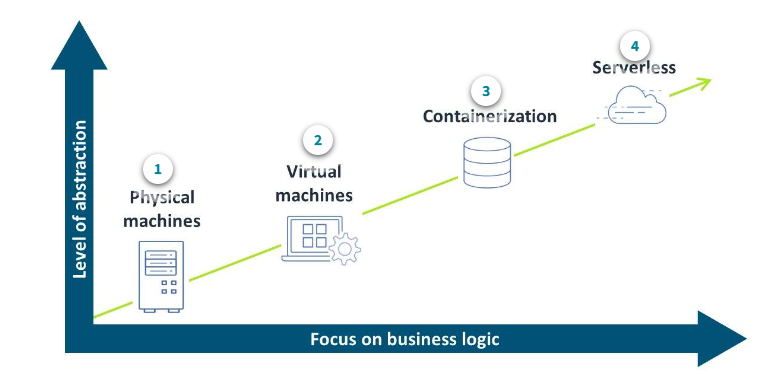
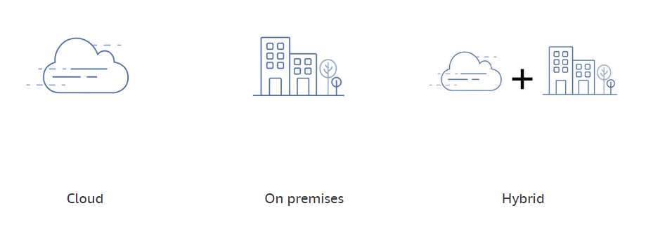

# AWS-Cloud-Computing

AWS-Amazon Web Services

### What is Cloud Computing?

- Cloud computing is the on-demand delivery of IT resources over the internet with pay-as-you-go pricing
- Instead of buying, owning, and maintaining physical data centers and servers, you can access technology services on an as-needed basis

### Trends in computing evolution

- The following visual depicts trends in computing evolution
- The higher you go in the abstraction levels, the more the cloud provider can add value and can off-load non-strategic activities from the consumer
- To learn more, choose each numbered marker

    

### Cloud computing deployment models

- When someone refers to "the cloud" in the context of a shared or public cloud, they are referring to on-demand infrastructure provided by a vendor, such as AWS

- Organizations that use the public cloud might take advantage of further solutions provided by a cloud services provider, such as one or any combination of the following:

    1. Software as a service (SaaS)
    2. Platform as a service (PaaS)
    3. Infrastructure as a service (IaaS)

    

### Patterns among AWS customers

- With respect to the path to cloud adoption, every customer travels a different path on their journey to the cloud
- Many internal and external factors influence the decision-making process and determine where they start on their journey 
- Adoptions are not always linear, and customers can be in any one of four different phases, sometimes at the same time
- To review details about the path to cloud adoption, choose each numbered marker,
    1. Develop and Test - The first phase involves either developing new applications or moving low-risk workloads